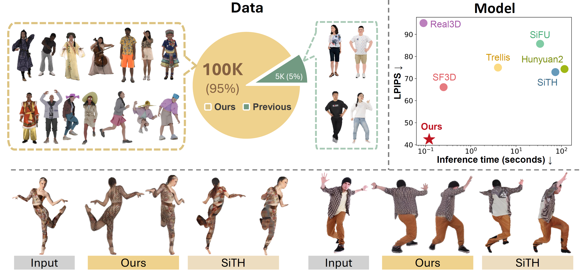

<div align="center">

# HumanNOVA: Photorealistic, Universal and Rapid 3D Human Avatar Modeling from a Single Image


<h4>✨ CVPR 2026 Highlight</h4>

<p>
  Hezhen Hu<sup>1</sup> &middot; Wangbo Zhao<sup>2</sup> &middot; Lanqing Guo<sup>1</sup> &middot; Hanwen Jiang<sup>1</sup> &middot; Jonathan C. Liu<sup>1</sup><br>
  Zhiwen Fan<sup>3</sup> &middot; Kai Wang<sup>2</sup> &middot; Zhangyang Wang<sup>1</sup> &middot; Georgios Pavlakos<sup>1</sup>
</p>

<p>
  <sup>1</sup>University of Texas at Austin &nbsp;&nbsp;|&nbsp;&nbsp;
  <sup>2</sup>National University of Singapore &nbsp;&nbsp;|&nbsp;&nbsp;
  <sup>3</sup>Texas A&amp;M University
</p>

<p>
  <a href="https://HumanNOVA.github.io/">
    
  </a>
</p>



</div>

<h2 id="overview">✨ Overview</h2>

HumanNOVA reconstructs photorealistic, universal and rapid 3D human from a single image. 
It benefits from both our generated large-scale data and feed-forward model design. 
Our data generation pipeline expands training data by 20 times, as visualized in the top-left. 
With this data, HumanNOVA achieves superior performance while maintaining rapid inference among existing methods, as shown in the top-right. 
Once trained, it is universal without the need for test-time fine-tuning or adaptation. 
Qualitative results show that HumanNOVA produces more precise photorealistic reconstructions compared to the state-of-the-art SiTH method, as shown at the bottom.

This repository currently focuses on inference and includes the local code and checkpoints required by the pipeline.


## 📰 News

- **May 2026**: Release inference code. 🤗
- **Feb 2026**: Our paper is accepted by CVPR 2026 Highlight! 🎉


<h2 id="environment-setup">⚙️ Environment Setup</h2>

### ✅ Recommended
Our setup script is built based on CUDA 12.1:

```bash
bash setup.sh
```

After setup finishes, download the asset [Link](https://download.is.tue.mpg.de/download.php?domain=smplify&resume=1&sfile=mpips_smplify_public_v2.zip). Place them in the repository root, then run:

```bash
bash extract_essentials.sh
```

<h2 id="inference-pipeline">🚀 Inference Pipeline</h2>

If you want to customize using your own images, open run_pipeline_wild.sh and set these paths for your local data:

```bash
INPUT_DIR="demo/input_images"
RGBA_DIR="demo/processed/rgba"
PROCESSED_DIR="demo/processed/rgb"
POINT_OUT_DIR="demo/output_results"
```

Path meanings:

- `INPUT_DIR`: directory containing the original input images.
- `RGBA_DIR`: directory where the background-removed RGBA images will be written.
- `PROCESSED_DIR`: directory where the resized RGB images for HMR/HumanNOVA will be written.
- `POINT_OUT_DIR`: directory where the final rendered outputs and meshes will be saved.

Run the full pipeline with:

```bash
conda activate humannova
bash run_pipeline_wild.sh
```

This script runs:

- `run_preprocess.py` writes processed input images.
- `hmr/hmr2.py` writes `smpl_est.pkl` next to the processed image directory.
- `run.py` writes the rendered outputs to the specified `--output-dir`.


<h2 id="acknowledgements">🤗 Acknowledgements</h2>

This research has been supported by the Sony Research Award Program and computing support on the Vista GPU Cluster through the Center for Generative AI (CGAI) and the Texas Advanced Computing Center (TACC) at the University of Texas at Austin. 
GP was supported by NSF IIS-2504906, IIS-2544200 and Gifts from Google and Adobe.Parts of the code are taken or adapted from the following repos:
- [SF3D](https://github.com/Stability-AI/stable-fast-3d)
- [Real3D](https://github.com/hwjiang1510/Real3D)
- [4D-Humans](https://github.com/shubham-goel/4D-Humans)
- [PTv3](https://github.com/pointcept/pointtransformerv3)

<h2 id="citation">📄 Citation</h2>
<!-- --- -->

If you find the code in this repo useful, please consider citing the following work.
```bibtex
@inproceedings{hu2026humannova,
  title={HumanNOVA: Photorealistic, Universal and Rapid 3D Human Avatar Modeling from a Single Image},
  author={Hu, Hezhen and Zhao, Wangbo and Guo, Lanqing and Jiang, Hanwen and Liu, Jonathan C. and Fan, Zhiwen and Wang, Kai and Wang, Zhangyang and Pavlakos, Georgios},
  booktitle={Proceedings of the IEEE/CVF Conference on Computer Vision and Pattern Recognition (CVPR)},
  year={2026}
}
```
